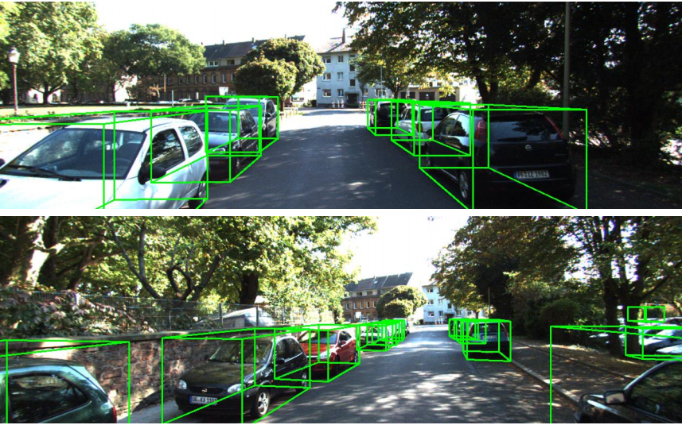

This project hosts the official implementation for the paper: 

**Deep Dive into Gradients: Better Optimization for 3D Object Detection with Gradient-Corrected IoU Supervision** 
[[PDF](https://openaccess.thecvf.com/content/CVPR2023/papers/Ming_Deep_Dive_Into_Gradients_Better_Optimization_for_3D_Object_Detection_CVPR_2023_paper.pdf)][[BibTex](https://ming71.github.io/Files/BibTeX/TIOEDet.html)]

( accepted by **CVPR 2023**). 


### Setup

```
pip install spconv-cu111
pip install Cmake
pip install -r requirement.txt
pip install mayavi
python setup.py develop

cd pcdet/ops/iou3d/cuda_op
python setup.py install
```


### Training
* Data Prepare
Download KITTI and organize it into the following form:
```
├── data
│   ├── kitti
│   │   │── ImageSets
│   │   │── training
│   │   │   ├──calib & velodyne & label_2 & image_2 & (optional: planes)
│   │   │── testing
│   │   │   ├──calib & velodyne & image_2
```
* Generatedata infos:
`python -m pcdet.datasets.kitti.kitti_dataset create_kitti_infos tools/cfgs/dataset_configs/kitti_dataset.yaml`
* Creat `.yaml` file
* Training the model via `python tools/train.py`


## Visualizations

 


## Citation

If you find our work or code useful in your research, please consider citing:


```
@inproceedings{ming2023deep,
  title={Deep Dive Into Gradients: Better Optimization for 3D Object Detection With Gradient-Corrected IoU Supervision},
  author={Ming, Qi and Miao, Lingjuan and Ma, Zhe and Zhao, Lin and Zhou, Zhiqiang and Huang, Xuhui and Chen, Yuanpei and Guo, Yufei},
  booktitle={Proceedings of the IEEE/CVF Conference on Computer Vision and Pattern Recognition},
  pages={5136--5145},
  year={2023}
}
```


Feel free to contact [me](chaser.ming@gmail.com)  if you have any questions.

